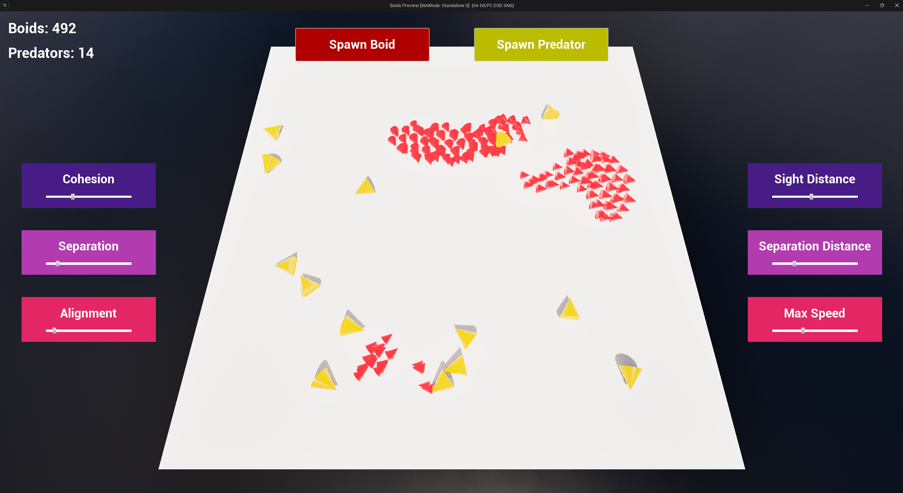

# Boids
My boids C++ logic for UE5.

While the Boids algorithm has long been solved, a recent interview involved the writing the algorithm in Unreal Engine 5. While the base objective was just to have basic flocking behavior with the ability to configure the settings in editor, I took it a few steps further and included UI controls that modify a UE data asset. This data asset is referenced by the Boids and updates the flocking behavior based on its values. The flocking algorithm, predator behavior, and UI controls are all written in C++.
